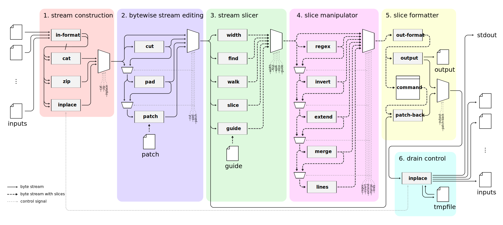

# nd − streamed blob manipulator

**nd** is an experimental tool that implements the concept of **"hexdump is also a binary patch"** in an easy-to-use and concise way. nd behaves as a common hexdump utility, while it can also apply its output to the original file as a patch. Combined with Unix text-processing commands and general text editors, nd provides handy and practical blob editing without compromising the scalability of text-processing commands and the flexibility of editors.

## Interpreting hexdump as a binary patch allows for flexible binary editing

Every record (line) of the output of nd is in the `offset length | array` form (Example 1). The record means the contents from `offset` to `offset + length` of the input file were the `array`.

```console
$ nd quick.txt
```

*Example 1. Dumping the contents of `quick.txt` in the hex format. After the second `|` is supplementary information called "mosaic."*

The `offset length | array` format can also be interpreted as a patch to the original data, which I call "hexdump is also a binary patch." Each record is an instruction to replace the contents of the input stream from `offset` to `offset + length` with the `array`. For example, applying the record `000000000010 0003 | 66 72 6f 67` as a patch to the `quick.txt` gives the following output (Example 2):

```console
$ nd --patch=<(echo "000000000010 0003 | 66 72 6f 67") quick.txt
```

*Example 2. Replacing the 3-byte "fox" from the offset 16 to 19 in the 45-byte `quick.txt` to 4-byte "frog." The total length increased by one to 46 bytes.*

Since hexdump and patch are in the same format, you can edit binary files by modifying the output of nd and feeding it to the original file via the `--patch` option. nd also has an option to do it at once, `--patch-back`, that passes the output to the stdin of an external command and receives its stdout as a patch to the original file. This option turns any text editor into a hex editor in combination with the `vipe` command (a thin wrapper provided in [moreutils](https://joeyh.name/code/moreutils/) that inserts a command-line editor like vim into the stream; Example 3).

```console
$ EDITOR=vim nd --inplace --patch-back=vipe quick.txt
  # you'll see the following lines in your vim, launched via the `vipe` command
  #
  # ```
  #   1 000000000000 0010 | 54 68 65 20 71 75 69 63 6b 20 62 72 6f 77 6e 20 | The quick brown
  #   2 000000000010 0010 | 66 6f 78 20 6a 75 6d 70 73 20 6f 76 65 72 20 74 | fox jumps over t
  #   3 000000000020 000d | 68 65 20 6c 61 7a 79 20 64 6f 67 2e 0a          | he lazy dog..
  # ```
  #
  # edit the lines as follows then `:wq`
  #
  # ```
  #   1 000000000000 0010 | 54 68 65 20 71 75 69 63 6b 20 62 72 6f 77 6e 20 | The quick brown
  #   2 000000000010 0010 | 66 72 6f 67 20 6a 75 6d 70 73 20 6f 76 65 72 20 74 | fox jumps over t
  #   3 000000000020 000d | 68 65 20 6c 61 7a 79 20 64 6f 67 2e 0a          | he lazy dog..
  # ```
  #
$ cat quick.txt
```

*Example 3. Editing the file using `nd` and `vipe` with the `--patch-back` option. The `--inplace` option tells nd to write back the patched stream to the original file. The mosaics after the second `|` are ignored when interpreting patches.*

It's a patch-based approach, so you don't need to load the entire lines if you edit only a part of the binary. For example, we can grep the output of nd with a pattern of interest to retrieve the lines to edit. It is like moving the cursor to the target location with the search-and-jump command in a hex editor, though the nd way is much more powerful than that as you can use arbitrary command-line tools to "move the cursor."

### nd --patch provides more intuitive binary editing than xxd --revert

nd treats insertions and deletions more intuitively than the xxd command (that provides similar hexdump-based binary editing). It's because of the difference in deciding where and how long to write the array.

* `nd --patch` replaces the input stream from `offset` to `offset + length` with the array, i.e., where and how-long are determined only from the patch record.
* `xxd --revert` determines the location and offset independently.
  * For the offset to write the array,
    * If the output is a seekable file, such as a regular file, the array is output at the offset of the file.
    * If the output is not a seekable file, such as a pipe, the array is written right after the previous output. The offset information is ignored.
  * For the length to write the array,
    * If the array is shorter than or equal to the length specified by the `--cols` option, the entire array is written.
    * If the array is longer than the length specified by the `--cols` option, the array contents up to the length are written (i.e., the array is clipped at the length).

This means that we need extra care if we insert or delete bytes with xxd, such as choosing the correct seekableness of the output file and setting a large-enough `--cols` so that the lines will not be truncated. In contrast, nd has no special caveats; arbitrary insertions and deletions are correctly expressed by merely adding or removing the bytes from the hexdump record.

### How is nd different from existing tools?

I'll compare several aspects of nd with existing tools, such as hex dumps, hex editors, binary analyzers, and binary patchers.

* nd does not provide interactive editing functionality, unlike traditional CUI/GUI hex editors like [bvi](http://bvi.sourceforge.net/), [hexedit](https://github.com/pixel/hexedit), etc.
* nd processes the target in a streaming manner. It's different from most hex editors but similar to [D3hex](https://d3nexus.de/en/projects/d3hex), [fq](https://github.com/wader/fq), and command-line hexdump utilities.
* nd doesn't recognize any file format or parse binary structs with a dynamic struct definition, unlike [Binspector](http://binspector.github.io), [FlexT](http://hmelnov.icc.ru/FlexT/FLEXT_CSCC99.htm), [fq](https://github.com/wader/fq), [Hachoir](https://hachoir.readthedocs.io/en/latest), [Hobbits](https://mahlet-inc.github.io), [Kaitai Struct](https://kaitai.io), [poke](http://www.jemarch.net/poke), [pytai](https://github.com/Dvd848/pytai), [struct (python)](https://docs.python.org/3/library/struct.html), [PREF](https://pref.github.io/), [Synalyze It](https://www.synalysis.net), and [Veles](https://codisec.com/veles/).
* nd doesn't parse executables or disassemble instructions, unlike [Binary Ninja](https://binary.ninja/), [Hextor](https://github.com/digitalw0lf/hextor), [Hiew](https://www.hiew.ru/), [ImHex](https://github.com/WerWolv/ImHex), [JDisassembly](https://github.com/Recoskie/JDisassembly), [PE Tools](https://github.com/petoolse/petools), [Radare2](https://github.com/radareorg/radare2), and [Rizin](https://rizin.re/).
* nd is equivalent to [VCDIFF](https://datatracker.ietf.org/doc/html/rfc3284) processors like [xdelta](https://github.com/jmacd/xdelta) and other diff-and-patch tools like [bspatch](http://www.daemonology.net/bsdiff/), [rdiff](https://github.com/librsync/librsync), and [UNIX cmp](https://en.wikipedia.org/wiki/Cmp_(Unix)) in that it patches binary files. nd processes a human-readable patch format, while these tools handle diffs and patches only in binary forms.

## Options and pipeline structure

nd is implemented as a pipeline that processes binary streams. Options of nd control what path the binary stream goes through and how it is processed in the nodes in the pipeline (Figure 1).



*Figure 1. The entire structure of the pipeline.*

Most options have abbreviations in addition to their complete forms (such as `-p` for  `--patch`). The [clap](https://docs.rs/clap/latest/clap/index.html) library parses options and arguments according to the GNU convention.

### Stage 1: Constructing a byte stream

The first stage of the pipeline is constructing the input byte stream. This stage controls how multiple input files are combined to create a stream. The options for this stage are exclusive.

#### -c, --cat N (default; N = 1)

It creates an input stream by serially concatenating the input files. `--filler` bytes are padded at the tail so that their length becomes multiple of `N` byte(s).

```console
$ nd --cat 7 quick.txt quick.txt
```

#### -z, --zip N

It creates an input stream by taking `N` bytes in the round-robin manner from the input files until the end of the shortest input file. `--filler` bytes are padded at the end of the shortest file if the last chunk is less than `N` bytes.

```console
$ nd --zip 7 quick.txt quick.txt
```

Also, the `--width` option with the size of the position and range reverses this operation.

```console
$ nd --zip 1 quick.txt quick.txt | nd --in-format x --width 2,0..1 --out-format b
```

#### -i, --inplace

It creates a stream with the option `--cat 1` for each input file and writes the output back to the file. The default output format differs depending on the drain node, `b` for `--output` and `x` for `--patch-back` (note: the `--output-format` option applies to the patches, not to the final outputs for this drain). The file remains intact if an error occurs in the pipeline.

Please be aware of disk I/O and disk vacancy when handling a large file with ` --inplace ` since the current implementation overwrites the entire file. The file's inode may change as it uses the `rename` system call to overwrite the original file.

```console
$ cat lazy.txt
$ nd --inplace --patch lazy.txt quick.txt
$ cat quick.txt
```

### Stage 2: Editing the stream in the byte granularity

In the second stage of the pipeline, nd manipulates the constructed byte stream. It cuts and concatenates particular spans (`--cut`), pads bytes before and after the stream (`--pad`), and applies a patch to the stream (`--patch`). The options in this stage are applied in this order without interfering with each other.

#### -n, --cut S..E[,S..E,...]

It creates a new stream by slicing and concatenating spans obtained by evaluating the S..E range expression. If two or more range expressions are given, it extracts the union of all spans obtained from them. If you want to leave overlapping ranges unmerged, or if you wish to keep interval information for further manipulation, use the ` --slice ` option instead.

```console
$ nd --cut 4..9 quick.txt
$ nd --cut 4..9,10..15,10..19 quick.txt
```

#### -a, --pad N,M

It adds `N` and `M` bytes of `--filler`s before and after the stream.

```console
$ nd --pad 4,6 quick.txt
```

#### -p, --patch FILE

It applies a patch file to the stream. A patch file must contain one patch record per line, and **the target intervals** (from ` offset ` to ` offset + length `) **must not overlap**. It interprets each record as follows:

* `offset length`: deletes bytes from `offset` to `offset + length`.
  * e.g., `00000005 0003` deletes the bytes of the stream from offset 3 to 8.
* `offset length | array`: replaces bytes from `offset` to `offset + length` with the `array`.
  * e.g., `00000005 0003 | 01 02 03 04` substitutes the bytes of the stream from offset 5 to 8 with `[0x01, 0x02, 0x03, 0x04]`.
* `offset length | array | mosaic`: is interpreted the same as `offset length | array`. It ignores the mosaic field.

```console
$ cat patch.txt
$ nd --patch patch.txt quick.txt
```

### Stage 3: Slicing the stream

In the third stage, nd puts "slices," defined as half-open ranges as [start offset, end offset), onto the stream. Options in this stage are exclusive.

#### -w, --width N[,S..E] (default; 16,s..e)

It cuts the stream into length-`N` non-overlapping slices and extends the slices by an S..E range expression. This option can't take two or more range expressions. If you want to create multiple slices from a slice of length `N`, combine this with the `--extend` option.

```console
$ nd --width 8,s-2..e+2 quick.txt
```

When using the output as a patch, note that overlapping slices are not allowed for patch inputs. The `--merge` option help you make them a valid patch by merging overlapping slices into a single one.

#### -d, --find ARRAY

It cuts match locations of `ARRAY` from the stream. `ARRAY` is in the same format as the `array` field of nd's hexdump, a space-separated array of bytes expressed in hex.

```console
$ nd --find "6f" quick.txt
$ nd --find "66 6f 78" quick.txt
```

#### -k, --walk EXPR[,EXPR,...]

It evaluates `EXPR ` to obtain a length and cuts the stream at that length into a slice and the stream remainder. When it receives multiple expressions, it evaluates them first and then repeats cutting for the number of expressions. It aborts the operation when the evaluated length is less than or equal to 0. The expressions are evaluated by the expression evaluation engine with the following variables supplied:

* `b`: an `i8`-casted array view over the stream.
* `h`: an `i16`-casted array view over the stream.
* `i`: an `i32`-casted array view over the stream.
* `l`: an `i64`-casted array view over the stream.

The elements are accessed in little endian for the `h`, `i`, and `l` variables. If you need an unsigned value, use a broader type and extract the lower unsigned part with shift and bitwise AND operations.

```console
$ nd walk.bin
$ nd --walk "b[0]" walk.bin
$ nd --walk "1,b[0]-1" walk.bin
```

#### -r, --slice S..E[,S..E,...]

It slices the stream with intervals obtained by evaluating range expressions in the `S..E` form. The slices are sorted by their (start position, end position) tuples before being fed to the next node.

```console
$ nd --slice 4..9 quick.txt
$ nd --slice 4..9,10..15,10..19 quick.txt
```

#### -g, --guide FILE

It reads the records of the `offset length | array | mosaic` format from `FILE` and slices the stream from `offset` to `offset + length`. The records must be sorted by their offsets. The `array` and `mosaic` fields are optional and are ignored if they exist.

```console
$ cat guide.txt
$ nd --guide guide.txt quick.txt
```

### Stage 4: Manipulating slices

In the fourth stage, it does slice manipulation operations such as stretching, inverting, and merging. The options in this stage are applied in this order without interfering with each other.

#### -e, --regex PCRE

It matches a regular expression (`PCRE`) on each slice and leaves the hits as new slices. Note that it doesn't match patterns that span two slices.

```console
$ nd --regex "[fd]o[xg]" quick.txt
```

#### -v, --invert S..E,[S..E,...]

It creates new slices from spans not covered by the input slices and then applies the S..E range expressions to them. The resulting slices are sorted by their (start position, end position) before being fed to the next node.

```console
$ nd --find "6f" quick.txt
$ nd --find "6f" --invert s..e quick.txt
$ nd --find "6f" --invert s+4..e-4 quick.txt
```

#### -x, --extend S..E,[S..E,...]

It applies S..E range expressions to each slice to get new slices. The resulting slices are sorted by their (start position, end position) before being fed to the next node.

```console
$ nd --find "6f" quick.txt
$ nd --find "6f" --extend s-4..e+4 quick.txt
```

When using the output as a patch, note that overlapping slices are not allowed for patch inputs. The `--merge` option help you make them a valid patch by merging overlapping slices into a single one.

#### -m, --merge N

It performs a fold operation, expressed by the pseudo-code below, on the slices sorted by (start position, end position).

```
acc = slices[0]
for slice in slices[1..] {
  if acc.end + N >= slice.start {
    acc.end = max(acc.end, slice.end)
  }
}
```

```console
$ nd --find "6f" quick.txt
$ nd --find "6f" --merge 4 quick.txt
$ nd --find "6f" --merge 8 quick.txt
```

#### -l, --lines S..E[,S..E,...]

It evaluates the S..E range expression and keeps slices within the half-open range [S, E). When it got multiple range expressions, it first evaluates all the expressions, takes the union of all ranges, and filters the input slices. The input slices are sorted by their (start position, end position) before being filtered.

```console
$ nd --width 4 --lines 0..3 quick.txt
$ nd --width 4 --lines 0..3,2..4,10.. quick.txt
```


### Stage 5: Constructing output from the slices

In the last stage, it formats the slices and concatenates them into an output byte stream. A drain node, `--output` or `--patch-back`, is applied to the byte stream to get the final output of nd.

#### -o, --output TEMPLATE (default; TEMPLATE = "-")

It dumps the slices sorted by their (start position, end position) to files in the format specified by the `--out-format` option. The destination filename is determined **for each slice** from `TEMPLATE`. The template is rendered with the following rules:

* Two variables are available:
  * `n` represents the offset of the first byte of the slice on the stream.
  * `l` represents the index of the slice (0-origin).
* The variable(s) can be rendered into the file name by evaluating them in the following ways:
  * `{VAR}` or `{VAR:FORMATTER} `, where `VAR` is either `n` or `l`, formats the variable to a text. `FORMATTER` is Rust's standard format specifier for the 64-bit integer (`i64`) type. It uses `d` as the default one.
  * `{(EXPR)}` or `{(EXPR):FORMATTER}` formats the value of `EXPR` to a text. It evaluates `EXPR` using the expression evaluation engine with the `n` and `l` variables. `FORMATTER` is the same as the first form.


The rendered filename is treated as follows:

* If the target filename is an empty string or `-`, it outputs the slice to stdout.
* Otherwise, it opens the target file and outputs the slice to the file. It clears the file before dumping the first slice to the target file. The second and later slices are just appended to the file.
  * For example, if you pass `file_{(l & 0x01)}` as the template, it collects all even-numbered slices to `file_0` and all odd-numbered slices to `file_1`.


```console
$ nd --output "dump_{n:02x}.txt" quick.txt
$ ls dump_*
$ cat dump_00.txt
```

```console
$ nd --width=4 --output "dump_{(l & 1)}.txt" quick.txt
$ ls dump_*
$ cat dump_0.txt
```

#### -P, --patch-back CMD

It formats slices sorted by their (start position, end position) to the `--out-format` and feeds them to the stdin of `CMD`. The stdout of the `CMD` is interpreted as a patch to the output byte stream of Stage 2.

```console
$ nd --find "6f" quick.txt | awk '{ printf "%s %s | 4f 4f\n", $1, $2 }'
$ nd --find "6f" --patch-back "awk '{ printf \"%s %s | 4f 4f\n\", \$1, \$2 }'" quick.txt
```

### Other options

#### -F, --in-format FORMAT

It specifies how to parse the input file(s).

* `x` tells nd to read a record of `offset length | array` form and construct a stream by putting the `array` at the `offset`.
  * Bytes not covered by records are filled with the `--filler`. The default value is zero.
  * If the filler is zero, the stream is equivalent to `/dev/zero` patched with the input file (i.e., `nd --patch input.bin /dev/zero`) except that the stream is truncated at `offset + length` of the last record.
* `nnx` tells nd to read a record of `offset length | array` form and construct a stream by concatenating all `array`s.
* `b` tells nd to feed the input bytes without parsing. It's the default value of this option.

```console
$ nd --width 8,s+2..e-2 quick.txt | nd --in-format x
$ nd --width 8,s+2..e-2 quick.txt | nd --in-format nnx
$ nd --width 8,s+2..e-2 quick.txt | nd --in-format b
```

#### -f, --out-format FORMAT

It specifies how to format the slices. Note that this option applies to the patch records fed to `CMD`, not the final output, for the `--patch-back` drain.

* `x` tells nd to format each slice to the `offset length | array | mosaic` format.
* `b` tells nd to put raw bytes.

```console
$ nd --width 8,s+2..e-2 quick.txt --out-format x
$ nd --width 8,s+2..e-2 quick.txt --out-format b
```

#### --filler N

It overwrites the padding values to `N` from the default value of zero. It can be used to create a flash ROM image where empty regions are filled with `0xff`.

```console
$ nd --filler 0xff --pad 4,4 quick.txt
$ nd --width 8,s+2..e-2 quick.txt | nd --filler 0xff --in-format x
```

#### --pager CMD

It feeds the stdout of nd to `CMD`.

* The default value is `less -F -S` if the output is a terminal. No pager is used by default if the output is piped to another command.
* If the user specifies the `--pager` option or sets the `PAGER` environment variable, it feeds the stdout to a pager. The `--pager` option precedes the `PAGER` environment variable.

## Expression evaluation engine

nd has an engine that evaluates an expression with variables to a 64-bit signed integer. It is used to evaluate expressions supplied as arguments of an option, denoted by a placeholder such as `N`, `M`, `S..E`, and `EXPR`.

* All evaluated values of constants, variables, and expressions are in the signed 64bit integer type.
* It supports C-language-style unary and binary operators. The precedence of the operators and parentheses are the same as the C.
* Variables with specific values may be supplied depending on each evaluation context. It supports C-language-style brackets for array variables. Negative indexes are treated as an error.
* Constants can have prefixes such as `0b`, `0o`, `0d`, and `0x` and are treated as binary, octal, decimal, or hexadecimal numbers, respectively. Leading `0` is treated as the octal prefix `0o`. Constants can also be qualified with SI (`k`, `M`, `G`, `E`) or binary prefixes (`ki`, `Mi`, `Gi`, `Ei`).

### S..E range expression

Options like `--cut` and `--slice` take range expression arguments in the `S..E` form. The range expression is a pair of expressions connected by `..` (e.g., `s + 2..e - 4`) and gives start and end offsets of a slice. Depending on options, the start and end offsets are calculated from either the entire stream's or input slice's start and end positions as follows:

* A constant `k` or an expression `s + k` points to the position `k` bytes ahead of the start of the stream or slice.
  * e.g., `3`, `1 + 2`, and `s + 3` all point to three bytes ahead of the start position.

* An expression `e + k` points to the position `k` bytes ahead of the end of the stream or slice.

```console
$ nd --cut "s+4*5.." quick.txt
$ nd --cut "4..e - 20" quick.txt
```

## Background

The initial idea of nd was obtained when I worked with the bam format, a widely used file format in bioinformatics next-generation sequencing (NGS) analyses. The bam format is a concatenation of multiple gzip blocks, each containing a small number of "sequence alignments" that represent a correspondence between two DNA sequences. As a single NGS sample (e.g., a sufficient amount to reconstruct a human genome) consists of several hundred or thousand million DNA fragments, the entire bam file sometimes gets hundreds of gigabytes.

Working with large bam files is quite a job, especially when it involves debugging programs or repairing broken bam files. For example, it's not rare to see a segmentation fault in an alignment processing routine caused by a weird sequence pattern or an unexpected file corruption due to a bit-flipping error during transfer. As the program takes over hours or days to process such a large file, it will inevitably take a long time to locate the error by running the same program with the same input (whether using gdb or relying on printf).

In most of these cases, it was practical to infer the location that caused the error from the evidence around and strip the "bad" gzip blocks away before re-running the program. Since a bam file is a concatenation of independent gzip blocks, a re-concatenation of the blocks without specific blocks is also a valid bam file. Once I removed the blocks that caused the error, I could run the analysis pipeline to the end to see roughly if the script is sane and will produce an expected result. Also, the extracted blocks helped debug the program as they can be used as a small input to reproduce the segmentation fault in a few seconds.

I always did this operation with a combination of standard Unix CLI tools like `od`, `grep`, `head`, and `tail`, but I sometimes had some complaints about them. For example, `od` (and other hexdump utilities I tried) took several hours to convert the entire file of several hundred gigabytes, and `head -c | tail -c` were not good at removing or extracting multiple blocks from a file.

So I decided to make a tool with the following features to make these operations more straightforward:

* A tool that can hexdump much faster than `od`. It's good if it can convert a file over a hundred gigabytes in a few minutes.
  * Fast hexdump is essential for this kind of debugging. Iterative filtering and sorting of a hexdump is a general and powerful way to collect evidence and identify the root cause of the problem. Taking diffs in the hex format is also helpful for easy filtering and comparing problematic regions (though its capability is limited compared to native binary diff tools).

* A tool that can cut and paste bytes easily.
  * It's good if it can remove or insert multiple bytewise regions in a simple and orthogonal way.

* A tool that can restore the original file from its hexdump. Also, a tool that can edit the file via its hexdump.
  * Since the region to edit has already been extracted, it would be nice if we could edit it directly. It should be easier than opening a hex editor and navigating to the appropriate edit location.

Since the bottleneck of existing hexdump utilities was apparently in the formatting of hex numbers, I wrote a routine to do it with SIMD instructions. The algorithm is mostly the same as the one in [xd](https://github.com/ocxtal/xd) I wrote several years ago. Also, I referred to [an article by Geoff Langdale and Wojciech Muła](http://0x80.pl/notesen/2022-01-17-validating-hex-parse.html) to implement a fast algorithm to validate and parse hex strings.

As for cut-and-paste and editing, I've always thought it would be helpful if we had a simple format to express patches to binary files. After some trial and error, I came up with the idea that each line of hexdump describes a span and its contents of a byte stream. I finally settled on the concept that "hexdump is also a binary patch" by implementing some functions to convert from/to hexdump records and to manipulate and substitute the content of slices.

## Copyright and License

2022, Hajime Suzuki. Licensed under MIT.
